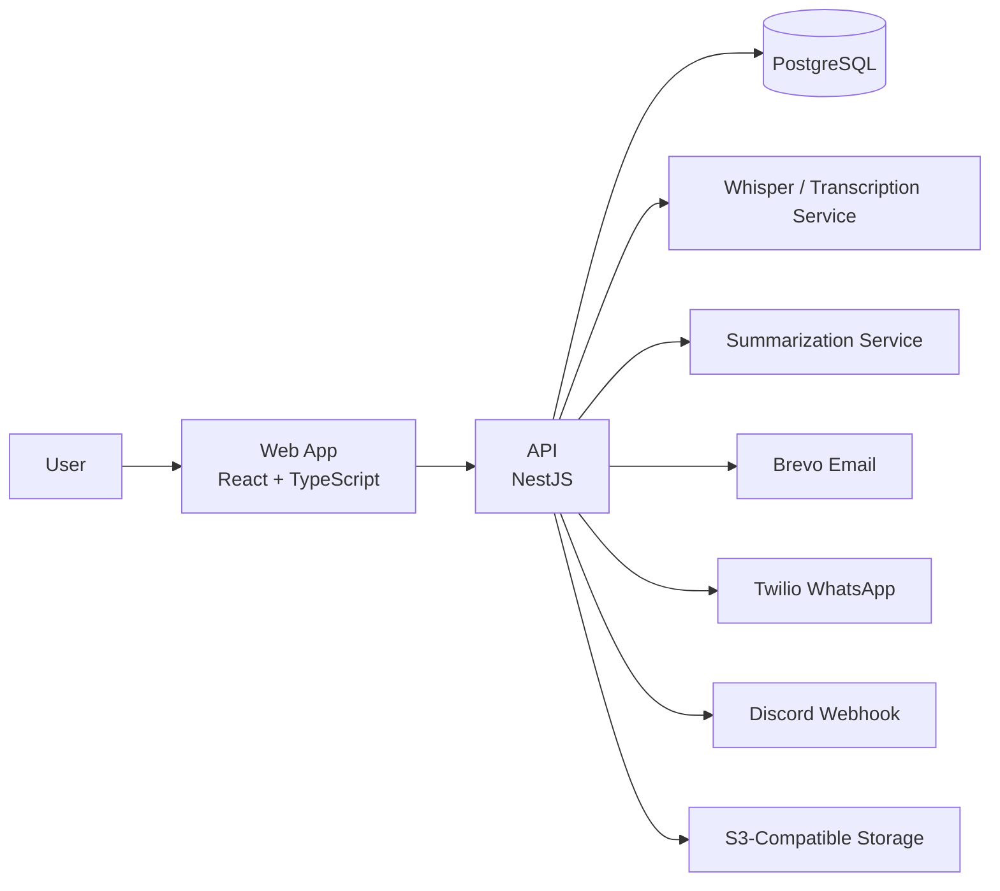
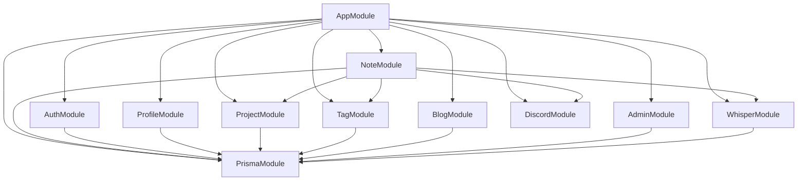
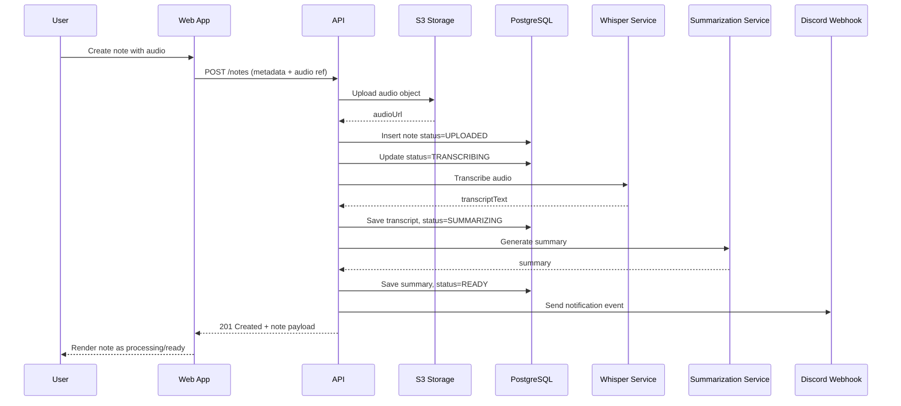
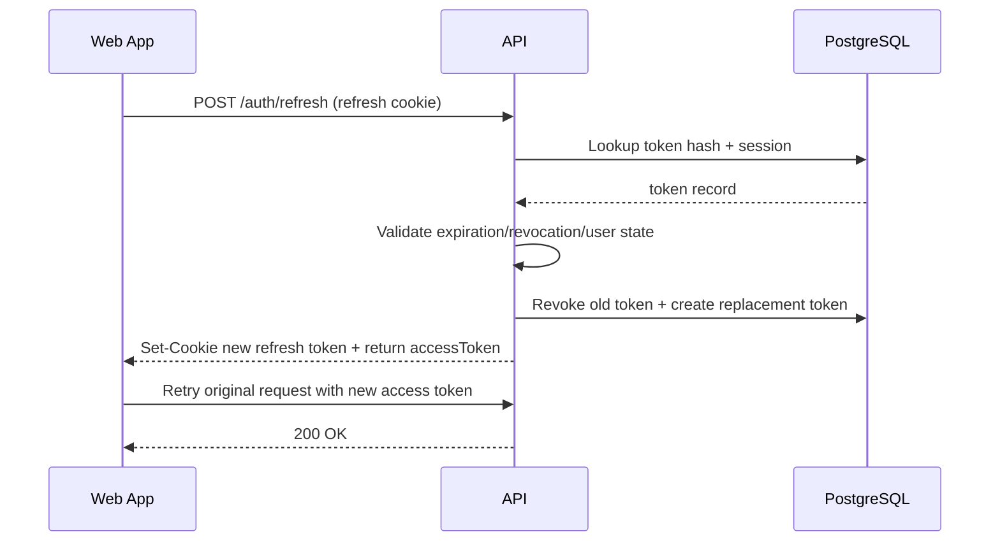
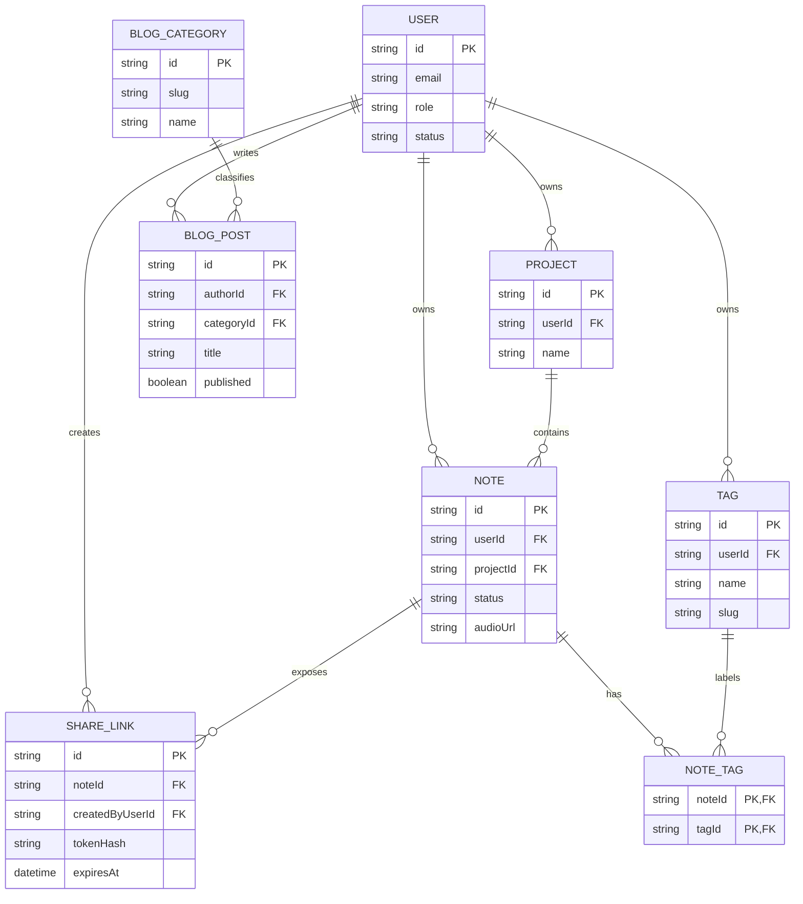

# Architecture Diagrams

## 1) System Context Diagram

## 2) Backend Module Diagram (NestJS)

## 3) Sequence Diagram — Create Audio Note

## 4) Sequence Diagram — Refresh Token Rotation

## 5) ER Diagram (High-Level)

