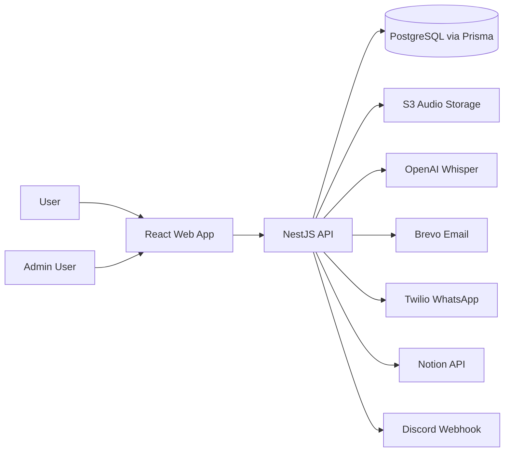
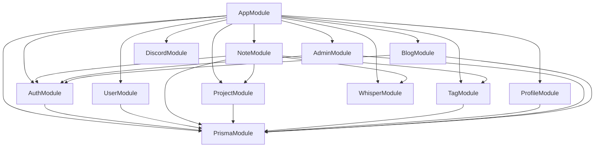
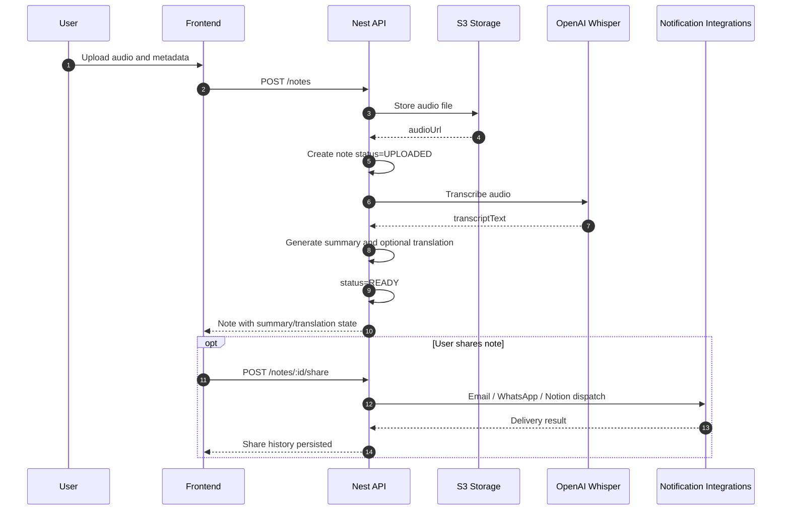
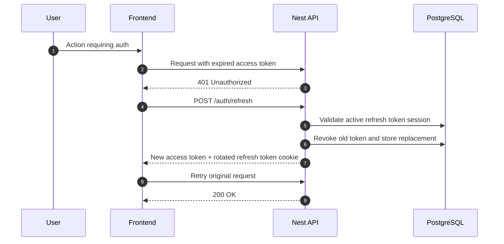
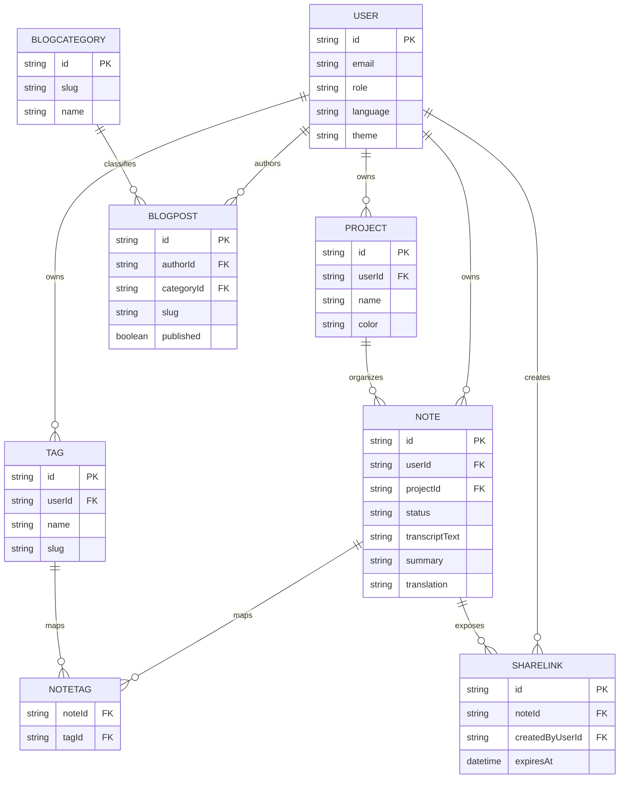
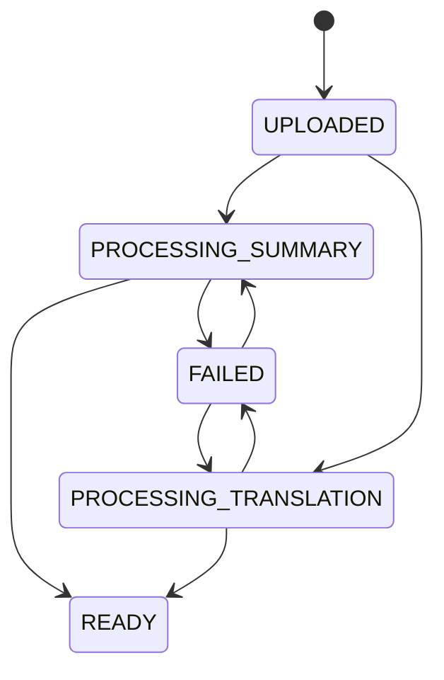

# Architecture Diagrams

## System Context

## Backend Module Dependencies

## Sequence: Create Audio Note

## Sequence: Refresh Token Rotation

## Entity Relationship Diagram

## Note Processing State

